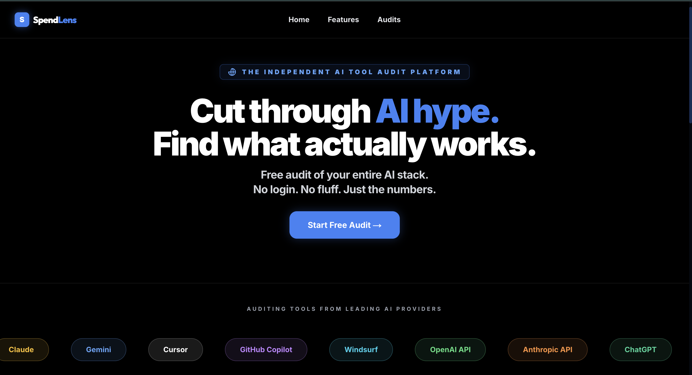
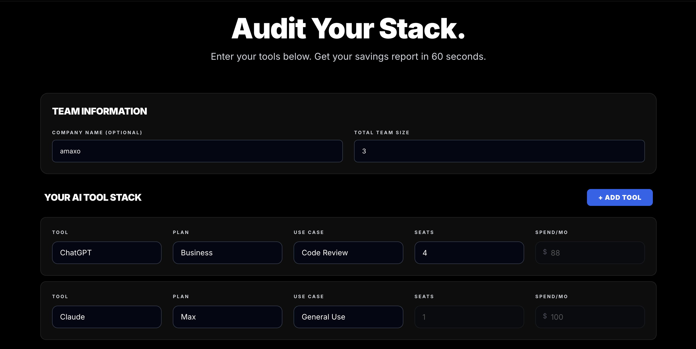
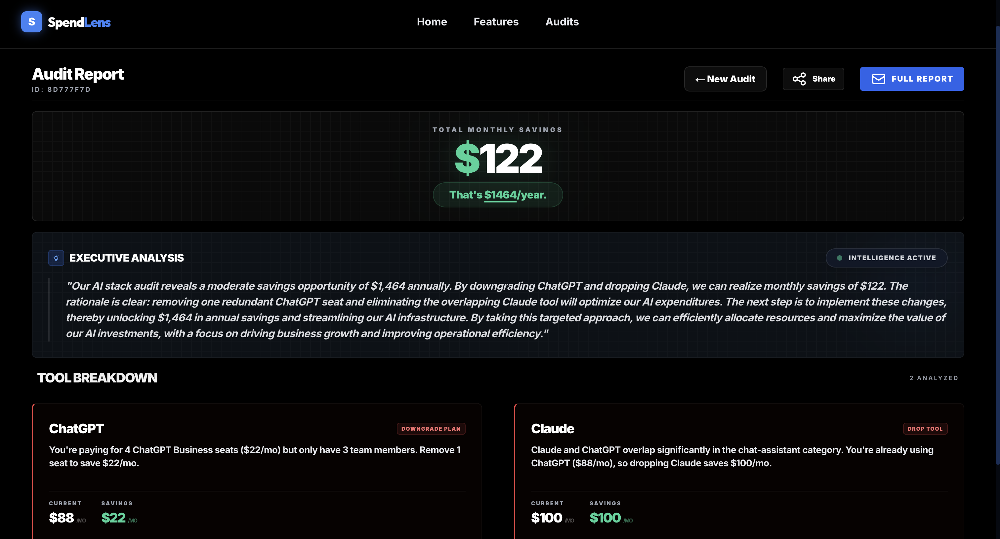
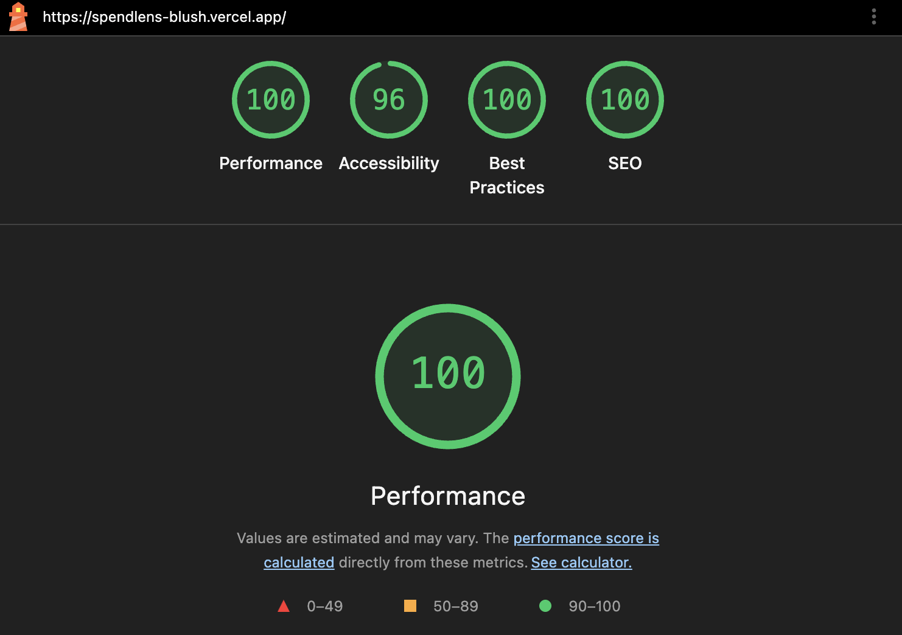

# SpendLens — AI Tool Spending Audit

SpendLens is a free web app that audits AI tool spending for startup 
engineering teams. It analyzes your stack (Cursor, Copilot, Claude, 
ChatGPT, etc.), detects plan mismatches and tool overlaps, and surfaces 
exact dollar savings. Built for engineering managers and founders who are 
spending $500–$5,000/mo on AI tools and have no idea if they're getting 
value.

**Live Demo:** [spendlens-blush.vercel.app](https://spendlens-blush.vercel.app)

---

## Screenshots

### Landing Page


### Audit Form


### Audit Results


### Lighthouse Scores (Mobile)


---

## Quick Start

### Prerequisites
- Node.js 20+
- npm 9+

### Install & Run Locally
```bash
git clone https://github.com/KHUSHI-612/spendlens.git
cd spendlens
npm install
cp .env.local.example .env.local   # fill in your API keys
npm run dev                         # → http://localhost:3000
```

### Environment Variables
```bash
NEXT_PUBLIC_SUPABASE_URL=
NEXT_PUBLIC_SUPABASE_ANON_KEY=
GROQ_API_KEY=
RESEND_API_KEY=
NEXT_PUBLIC_APP_URL=https://spendlens-blush.vercel.app
```

### Run Tests
```bash
npm test
```

### Deploy to Vercel
```bash
npm i -g vercel
vercel --prod
```
Or connect the GitHub repo to Vercel Dashboard for auto-deploys.

---

## Decisions — 5 Trade-offs I Made

**1. Pure logic audit engine over LLM-powered analysis**
Chose hardcoded rules in `auditEngine.ts` with zero AI for the core 
audit. Deterministic results are testable, reproducible, and free. An 
LLM might give more nuanced advice but would add latency, cost per audit, 
and make testing nearly impossible. The rules cover the 80% case. Groq 
is used only for a 100-word summary enhancement — the audit works 
perfectly without it.

**2. No authentication — email captured after value is shown**
No login wall. Full results shown before asking for email. Every login 
wall kills conversion. The user needs to trust the tool before giving 
their email. By showing $X in savings first, the email capture becomes 
a natural next step rather than a gate. This also means the shareable 
URL works without friction. Trade-off: can't track returning users. 
Worth it for a lead-gen tool.

**3. JSONB columns for audit data in Supabase**
Stored the entire audit payload as JSONB rather than normalized tables. 
An audit is a point-in-time snapshot — if tool pricing changes next 
week, existing audits should still show the original analysis. 
Normalizing would add 4+ tables and complex joins for no practical 
MVP benefit. Trade-off: can't do SQL queries like "how many users are 
on Cursor Business." Acceptable for this stage.

**4. localStorage for form persistence over server-side drafts**
localStorage saves form state on every keystroke with zero backend 
calls during form filling. No auth needed. User closes tab, comes back, 
form is intact. Trade-off: no cross-device sync. Acceptable for a tool 
that takes 60 seconds to complete.

**5. Groq over Anthropic API for AI summary**
Anthropic API requires paid credits. Groq provides free inference with 
llama-3.3-70b-versatile which is OpenAI-compatible. The architecture 
is identical — swapping back to Anthropic requires changing one 
environment variable and one model name string. Documented in 
docs/PROMPTS.md.

---

## Project Structure
src/
├── app/
│   ├── layout.tsx              # Root layout: nav, fonts, meta tags
│   ├── page.tsx                # Landing page with hero + audit form
│   ├── globals.css             # Design system (Tailwind + custom)
│   ├── audit/[id]/page.tsx     # Shareable audit results page
│   └── api/
│       ├── audit/route.ts      # POST: run audit | GET: fetch by ID
│       ├── summary/route.ts    # POST: Groq AI summary with fallback
│       └── lead/route.ts       # POST: email capture + Resend email
├── components/
│   ├── SpendForm.tsx           # Interactive multi-tool spending form
│   ├── AuditResults.tsx        # Results cards + savings display
│   ├── LeadCapture.tsx         # Email capture (post-results)
│   └── ShareButton.tsx         # Shareable URL + copy button
├── lib/
│   ├── auditEngine.ts          # Core audit logic (pure functions)
│   ├── tools.ts                # Tool & plan pricing database
│   └── supabase.ts             # Supabase client
└── types/
└── index.ts                # TypeScript interfaces
tests/
└── auditEngine.test.ts         # 8 unit tests for audit engine
docs/
├── PRICING_DATA.md             # Verified pricing sources for all tools
├── ARCHITECTURE.md             # System diagram and data flow
├── DEVLOG.md                   # Daily development log
├── REFLECTION.md               # Technical decisions and learnings
├── TESTS.md                    # Test coverage documentation
├── PROMPTS.md                  # AI prompt library and rationale
├── GTM.md                      # Go-to-market strategy
├── ECONOMICS.md                # Unit economics and $1M ARR path
├── USER_INTERVIEWS.md          # User research notes
├── LANDING_COPY.md             # Landing page copy
└── METRICS.md                  # North star metric and instrumentation

---

## Tech Stack

| Layer | Choice | Why |
|-------|--------|-----|
| Framework | Next.js 14 (App Router) | Server components for OG tags, API routes collocated, Vercel-native |
| Language | TypeScript | Type safety across form → engine → API → DB |
| Styling | Tailwind CSS v3 | Rapid iteration, design tokens, dark mode built-in |
| Database | Supabase (PostgreSQL) | Free tier, instant setup, JSONB support, Row Level Security |
| AI Summary | Groq (llama-3.3-70b) | Free tier, OpenAI-compatible, near-instant LPU inference |
| Email | Resend | Developer-first API, generous free tier |
| Testing | Jest + ts-jest | Standard, fast, good TypeScript support |
| CI/CD | GitHub Actions | Free for public repos, runs on every push to main |
| Hosting | Vercel | Zero-config Next.js deploys, edge network, preview URLs |

---

## Documentation

Full project documentation is in the `docs/` folder including 
architecture decisions, pricing sources, go-to-market strategy, 
unit economics, and user research.

See [docs/ARCHITECTURE.md](docs/ARCHITECTURE.md) for system 
diagram and data flow.
