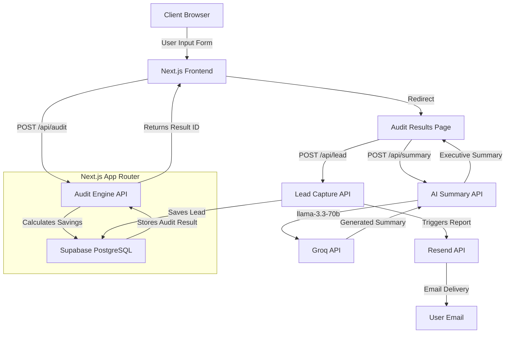

# Architecture - SpendLens

## System Diagram

## Data Flow

How a user's input becomes an audit result:

1. **Input Submission**: The user selects their currently paid AI tools and team sizes on the landing page and submits the form.
2. **Deterministic Audit**: The data is sent via `POST /api/audit`. The SpendLens Audit Engine evaluates the input strictly against hardcoded pricing tiers, feature overlaps, and usage limits without relying on slow or hallucination-prone LLMs.
3. **Storage**: The calculated `AuditResult` (including the exact savings amounts and recommendations) is saved to a Supabase database. A unique Audit ID is returned to the frontend.
4. **Result Rendering & AI Summary**: The user is redirected to `/audit/[id]`. On load, the page calls `POST /api/summary`, which passes the deterministic financial results to the Groq API (running `llama-3.3-70b-versatile`) to generate a concise, personalized "Executive Summary."
5. **Lead Capture**: If the user wants the full report, they enter their email. `POST /api/lead` saves their contact info to Supabase (linking it to the `AuditResult`) and triggers Resend to email them the full PDF report.

## Why This Stack?

The current stack prioritizes speed of execution, zero-maintenance scaling, and low latency:

- **Next.js (App Router) + React**: Enables seamless full-stack deployment on Vercel. We can build the frontend and backend API routes in a single unified repository.
- **Tailwind CSS**: Allows for rapid iteration of a "Quiet Luxury" SaaS aesthetic directly within React components.
- **Supabase**: Provides a fully managed PostgreSQL database with an out-of-the-box API. It requires zero infrastructure setup and scales cleanly for MVP needs.
- **Groq API**: By using `llama-3.3-70b` over Groq's LPU inference engine rather than standard OpenAI models, the AI executive summary generation is nearly instantaneous, ensuring the user doesn't stare at a loading spinner.
- **Resend**: Developer-friendly email API that is trivial to integrate with Next.js for reliable transactional email delivery.

## Scaling to 10k Audits/Day

If SpendLens suddenly had to process 10,000 audits per day, the current stack would largely handle it due to Vercel and Supabase's serverless nature. However, a few architectural changes would be required to ensure performance and cost efficiency:

1. **Database Connection Pooling**: 10k audits/day means intense bursts of database writes. We would need to enable Supabase's IPv4 connection pooling (PgBouncer/Supavisor) to prevent the Next.js serverless functions from exhausting database connections.
2. **Asynchronous Email Queues**: Currently, `POST /api/lead` triggers Resend synchronously. At high volume, this needs to be decoupled. We would push the lead to a queue (like Upstash Kafka or Redis) and have a background worker handle the Resend API call with retry logic.
3. **Edge Caching for Pricing Data**: If the deterministic audit engine relies on database lookups for current tool pricing, we would move that pricing data into Edge Config or Redis so the audit calculations happen globally at the edge without hitting PostgreSQL.
4. **Rate Limiting**: With 10k legitimate audits, we would also attract spam. We would implement strict rate limiting via Vercel KV or Upstash on the `/api/audit` and `/api/summary` endpoints to prevent abuse of the Groq API and database stuffing.

---

## Known Limitation - Resend Email

Resend free tier only sends to the account owner's email until a custom domain is verified. For this demo, email delivery is functional but scoped to verified addresses.

Production fix: verify a custom domain in Resend dashboard (requires owning a domain). The email template, API route, and lead capture logic are all production-ready - only the domain verification step is pending.

---

## Security & Abuse Protection

- **Honeypot field**: Lead capture form includes a hidden "website" field. If filled (by bots), the request is silently rejected with 200 OK so bots don't know they were blocked.
  
- **Rate limiting**: Same email address cannot submit more than once per hour. Checked against Supabase before inserting. Returns 429 if limit exceeded.

- **Supabase RLS**: Audits table is public read/insert only. Leads table is insert-only from client - emails cannot be queried from the browser.

- **No secrets in repo**: All API keys in .env.local, excluded via .gitignore. Environment variables set in Vercel dashboard for production.
